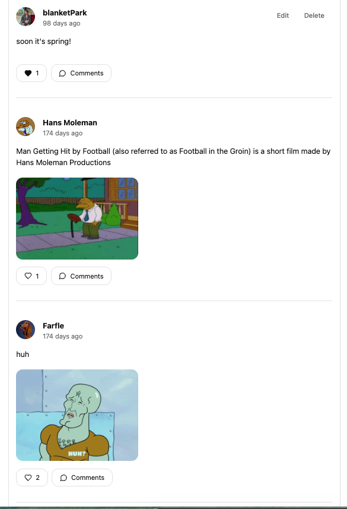
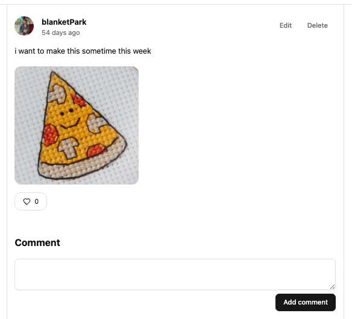
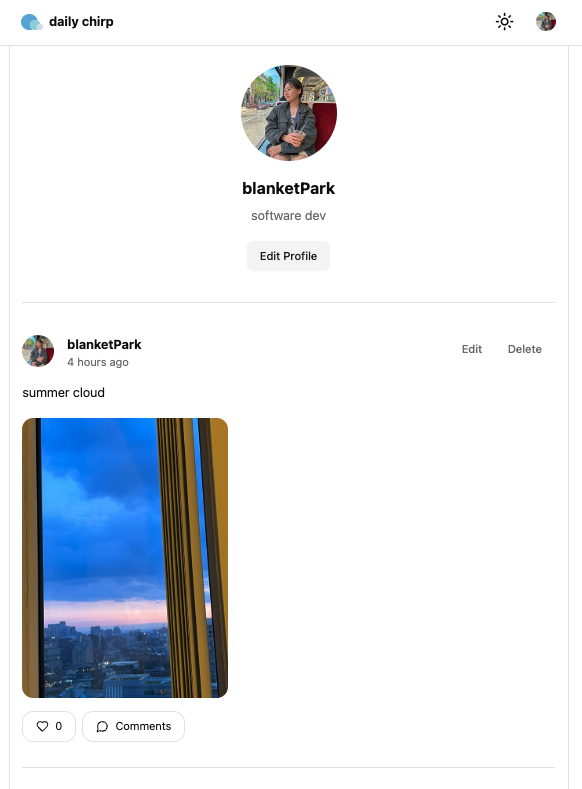
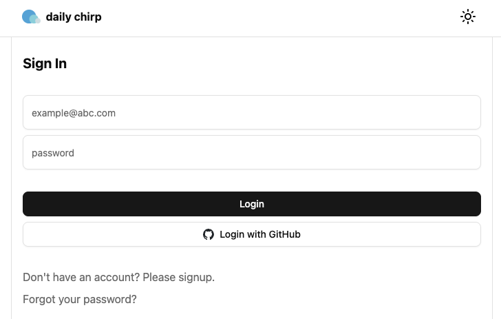

# Daily Chirp

Short-form social feed. Post updates, attach images, like and comment on others' posts.



## Tech Stack

| Layer | Stack |
|---|---|
| Frontend | React 19, TypeScript, Vite |
| Styling | Tailwind CSS v4 |
| Routing | React Router v7 |
| Server State | TanStack Query v5 |
| Client State | Zustand |
| UI Components | Radix UI, Lucide Icons |
| Backend | Supabase (Auth, PostgreSQL, Storage) |
| Deployment | Vercel |

## Features

### Feed


Paginated post list with infinite scroll. Each post shows author info, relative timestamp, content preview (2-line clamp), and an image carousel for multi-image posts.

### Post Detail



Full post content with comments. Authors can edit or delete their own posts.

### Likes and Comments

Like any post with optimistic UI updates. Leave comments with real-time count display.

### Profile



User profile page showing avatar, nickname, and that user's posts filtered from the feed. Edit your own profile info.

### Auth



Email/password sign-up and sign-in. Password reset via email. Route guards split pages into guest-only and member-only layouts.

## Project Structure

```
src/
  api/            # Supabase query functions (post, comment, profile, auth, image)
  components/
    comment/      # CommentList, CommentItem, CommentEditor
    layout/       # GlobalLayout, GuestOnlyLayout, MemberOnlyLayout
    modal/        # Post editor, profile editor modals
    post/         # PostFeed, PostItem, CreatePost, EditPost, DeletePost, LikePost
    profile/      # ProfileInfo, EditProfileButton
    ui/           # Button, Input, Textarea, Dialog, Carousel, etc.
  hooks/
    mutations/    # auth, post, comment, profile mutation hooks
    queries/      # useInfinitePostsData, usePostByIdData, useProfileData, useCommentsData
  pages/          # Route-level page components
  provider/       # SessionProvider, ModalProvider
  store/          # Zustand stores (session, modals)
  lib/            # Supabase client, utils, constants, error handling
  types.ts        # Post, Comment, Profile type definitions
```

## Getting Started

```bash
npm install
npm run dev
```

Create a `.env.local` file with your Supabase credentials:

```
VITE_SUPABASE_URL=your-project-url
VITE_SUPABASE_ANON_KEY=your-anon-key
```

Regenerate database types after schema changes:

```bash
npm run type-gen
```
